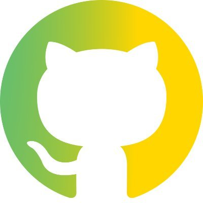

---

Read in English

# Welcome to GitHub Brasil 🇧🇷

In this repo, you can find resources and information for the developer community in Brasil.

 * [Open Source](#--open-source)
     * [Resources](#resources)
* [Developers](#octocat--developers)
     * [Meetups & GitTogethers](#meetups)
     * [GitHub Stars](#github-stars)
     * [The ReadME Project](#the-readme-project)
* [Students](#-students)
     * [Campus Program](#campus-program)
     * [Student Developer Pack](#student-developer-pack)
     * [Campus Experts](#campus-experts)
* [Startups](#-startups)
     * [GitHub for startups](#github-for-startups)
* [Events](#-events)
* [Let's connect](#-lets-connect)
* [Contributing](#️contributing)
* [License](#-license)

---

## 🧑‍💻  Open Source

The open source movement in Brasil has gained significant momentum in recent years, with a growing number of developers and organizations adopting open source technologies and contributing to the open source community. 

### Projects and Maintainers from Brasil

There are many open-source projects that we might be using frequently, but unaware that it's a project that was created in or receiving significant contributions from Brasil. We have collated some of the projects and maintainers from Brasil on the [githubbrasil.com website].(https://githubbrasil.com)

If you know of any other projects or maintainers from Brasil, feel free to make a [contribution.](./CONTRIBUTING.md)

### Resources

If you are looking to make your first contribution to open source, or even an experienced maintainer looking for ways to grow your community — we have resources to help you! Check out the [Open Source Guide](https://opensource.guide/pt/) which has many resources on how to start an open-source project, build communities, best practices for maintainers, and a lot more!

---

## :octocat:  Developers

GitHub is the platform where millions of developers and companies build, ship and maintain their software. We help developers with the resources they need and showcase their awesome work to the rest of the community.

### Meetups 

GitHub Brasil Virtual Meetup group is for developers in Brasil, by developers in Brszil, and fuelled by the love for Open Source! [Join us on the Meetup group](https://www.meetup.com/githubbrasil/) and come check out the latest on GitHub, learn about new open source projects, and meet maintainers & GitHub staff from Brasil.

### GitHub Stars

The GitHub Stars program thanks GitHub’s most influential developers and gives them a platform to showcase their work, reach more people, and shape the future of GitHub. Say hello 👋🏼 to the [GitHub Stars from Brasil!](https://stars.github.com/profiles/?country=Brazil)

If you know an inspiring community leader, [we want to hear about it.](https://stars.github.com/nominate/)

### The ReadME Project

The ReadME Project is part of GitHub’s ongoing effort to amplify the voices of the developer community. It’s an evolving space to engage with the community and explore the stories, challenges, technology, and culture that surround the world of open source.

Check out the stories of [Felipe De Morais](https://github.com/readme/stories/felipe-de-morais) and [Pedro Nauck](https://github.com/readme/stories/pedro-nauck) from Brazil.

We’re always on the lookout for inspiring developers who passionately dedicate themselves to their communities. Know somebody whose story deserves to be told? [Let us know](https://github.com/readme/nominate), and they could end up being featured on The ReadME Project.

---

## 🧑‍🎓 Students

GitHub Education helps students, teachers, and schools access the tools and events they need to shape the next generation of software development.

### Campus Program

With the GitHub Campus Program, your school will get a package of technical tools, training for faculty members, and support to grow technical communities on campus. Learn more and enroll your school in the [GitHub Campus Program.](https://education.github.com/schools)

### Student Developer Pack

There's no substitute for hands-on experience. But for most students, real-world tools can be cost-prohibitive. That's why we created the GitHub Student Developer Pack with some of our partners and friends: to give students free access to the best developer tools in one place so they can learn by doing. Check out the tools and get your [Student Developer Pack.](https://education.github.com/pack)

### Campus Experts

Campus Experts are student leaders that strive to build diverse and inclusive spaces to learn skills, share their experiences, and build projects together. They can be found across the globe leading in-person and online conferences, meetups, and hackathons, and maintaining open source projects. Explore and connect with [Campus Experts from Brasil.](https://githubcampus.expert/experts)

---

## 📈 Startups

Brasil has a vibrant tech startup community, with many entrepreneurs choosing GitHub to enable innovation. 

### GitHub for Startups

GitHub for Startups program helps startups go from idea to IPO on the world’s best software development platform with free access to GitHub Enterprise

For details about the program, [check out startups.github.com](https://startups.github.com)

---

## 📢 Events

Connect with the GitHub community through conferences, meetups and hackathons.

---

## 💬 Let's connect

Stay tuned to what's happening with GitHub Brasil by [following us on Twitter](https://twitter.com/GitHubBrasil).

You are also welcome to participate in [GitHub Discussions](https://github.com/github/brazil/discussions/categories/general) on this repository. Please respect the [code of conduct](CODE_OF_CONDUCT.md) and be awesome to each other!

---

## Contributing

Contributions are welcome to certain parts of this repository. For getting started, check out [CONTRIBUTING.md](https://github.com/github/brasil/blob/main/CONTRIBUTING.MD)

---

## 📜 License

Content is released under CC0-1.0. Code is released under MIT License.

When using the GitHub logos, be sure to follow the [GitHub logo guidelines](https://github.com/logos).

# Boas vindas ao GitHub Brasil 🇧🇷

Neste repositório, você pode encontrar recursos e informações para a comunidade de pessoas desenvolvedoras no Brasil.

* [Código Aberto](#--open-source)
     * [Recursos](#recursos)
* [Devs](#octocat--desenvolvedores)
     * [Meetups & GitTogethers](#meetups)
     * [GitHub Stars](#github-stars)
     * [Projeto ReadME](#the-readme-project)
* [Estudantes](#-estudantes)
     * [Programa Campus](#campus-program)
     * [GitHub Student Pack](#student-developer-pack)
     * [Campus Experts](#campus-experts)
* [Startups](#-startups)
     * [GitHub para Startups](#github-for-startups)
* [Eventos](#-eventos)
* [Vamos nos conectar](#-vamos-nos-conectar)
* [Contribuindo](#️contribuindo)
* [Licença](#-licença)

---

## 🧑‍💻 Código Aberto

O movimento de código aberto no Brasil tem ganhado impulso significativo nos últimos anos, com um número crescente de pessoas desenvolvedoras e organizações adotando tecnologias de código aberto e contribuindo para a comunidade.

### Projetos e Pessoas Mantenedoras do Brasil

Existem muitos projetos de código aberto que podemos estar usando frequentemente, mas sem saber que é um projeto criado ou recebendo contribuições significativas do Brasil. Nós reunimos alguns dos projetos e pessoas do Brasil no site [githubbrasil.com](https://githubbrasil.com)

Se você conhece outros projetos ou pessoa mantenedoras do Brasil, sinta-se à vontade para fazer uma [contribuição](./CONTRIBUTING.md)

### Recursos

Se você está procurando fazer sua primeira contribuição para o código aberto, ou é uma pessoa mantenedora experiente procurando maneiras de aumentar sua comunidade - temos recursos para ajudá-lo! Confira o [Guia de Código Aberto](https://opensource.guide/pt/) que possui muitos recursos sobre como iniciar um projeto de código aberto, construir comunidades, melhores práticas para manter projetos e muito mais!

---

## :octocat: Devs

O GitHub é a plataforma onde milhões de pessoas desenvolvedoras e empresas constroem, entregam e mantêm seu software. Ajudamos essas pessoas com os recursos necessários e exibimos seu trabalho incrível para o restante da comunidade.

### Meetups 

O grupo de Meetup virtual do GitHub Brasil é para devs no Brasil, por devs no Brasil, e alimentado pelo amor pelo Código Aberto! [Junte-se a nós no grupo Meetup](https://www.meetup.com/githubbrasil/) e venha conferir as últimas novidades do GitHub, conhecer novos projetos de código aberto e encontrar pessoas mantenedoras e funcionários do GitHub do Brasil.

### GitHub Stars

O programa Estrelas do GitHub agradece a pessoas desenvolvedoras mais influentes do GitHub e lhes dá uma plataforma para exibir seu trabalho, alcançar mais pessoas e moldar o futuro do GitHub. Dê um olá 👋🏼 às [Estrelas do GitHub do Brasil!](https://stars.github.com/profiles/?country=Brazil)

Se você conhece uma pessoa líder comunitário inspiradora e que te ensinou algo sobre Git, GitHub ou Open Source no geral, [queremos saber.](https://stars.github.com/nominate/)

### O Projeto ReadME

O Projeto ReadME faz parte do esforço contínuo do GitHub para amplificar as vozes da comunidade É um espaço em constante evolução para se engajar com a comunidade e explorar as histórias, desafios, tecnologia e cultura que cercam o mundo do código aberto.

Confira as histórias de [Felipe De Morais](https://github.com/readme/stories/felipe-de-morais) e [Pedro Nauck](https://github.com/readme/stories/pedro-nauck) do Brasil.

Estamos sempre procurando por pessoas inspiradoras que se dediquem apaixonadamente às suas comunidades. Conhece alguém cuja história merece ser contada? [Nos conte](https://github.com/readme/nominate), e elas podem acabar sendo apresentadas no Projeto ReadME.

---

## 🧑‍🎓 Estudantes

O GitHub Education ajuda estudantes, professores e escolas a acessar as ferramentas e eventos de que precisam para moldar a próxima geração de desenvolvimento de software.

### Programa Campus

Com o Programa Campus do GitHub, sua escola receberá um pacote de ferramentas técnicas, treinamento para membros do corpo docente e suporte para crescer comunidades técnicas no campus. Saiba mais e inscreva sua escola no [Programa Campus do GitHub](https://education.github.com/schools).

### Student Developer Pack

Não há substituto para a experiência prática. Mas, para a maioria dos estudantes, as ferramentas do mundo real podem ser proibitivas em termos de custo. É por isso que criamos o Student Developer Pack (Pacote de Desenvolvimento para Estudantes) do GitHub com alguns de nossos parceiros e amigos: para dar aos estudantes acesso gratuito às melhores ferramentas de desenvolvimento em um só lugar, para que possam aprender fazendo. Confira as ferramentas e obtenha seu [Student Developer Pack](https://education.github.com/pack).

### Campus Experts

Campus Experts são líderes estudantis que se esforçam para construir espaços diversos e inclusivos para aprender habilidades, compartilhar suas experiências e construir projetos juntos. Podem ser encontrados em todo o mundo liderando conferências, meetups e hackathons presenciais e online, e mantendo projetos de código aberto. Explore e conecte-se com [Campus Experts do Brasil](https://githubcampus.expert/experts).

---

## 📈 Startups

O Brasil possui uma grande comunidade de startups de tecnologia, com muitos empreendedores escolhendo o GitHub para permitir a inovação.

### GitHub para Startups

O programa GitHub for Startups ajuda as startups a ir da ideia ao IPO na melhor plataforma de desenvolvimento de software do mundo com acesso gratuito ao GitHub Enterprise.

Para obter detalhes sobre o programa, [confira startups.github.com](https://startups.github.com).

---

## 📢 Eventos

Conecte-se com a comunidade do GitHub por meio de conferências, meetups e hackathons.

---

## 💬 Vamos nos conectar

Fique por dentro do que está acontecendo com o GitHub Brasil [nos seguindo no Twitter](https://twitter.com/GitHubBrasil).

Você também é bem-vindo para participar das [Discussões do GitHub](https://github.com/github/brazil/discussions/categories/general) neste repositório. Por favor, respeite o [código de conduta](CODE_OF_CONDUCT.md) e seja incrível com os outros!

---

## Contribuindo

Contribuições são bem-vindas para certas partes deste repositório. Para começar, confira For contributing to the content, check out [CONTRIBUTING.md](https://github.com/github/brasil/blob/main/CONTRIBUTING.MD).

---

## 📜 Licença

O conteúdo é liberado sob CC0-1.0. O código é liberado sob a Licença MIT.

Ao usar os logotipos do GitHub, certifique-se de seguir as [diretrizes de logotipo do GitHub](https://github.com/logos).
